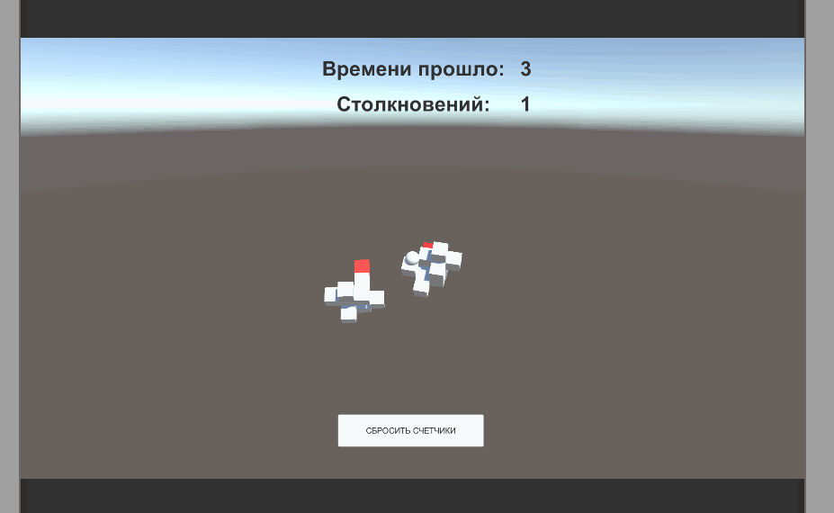
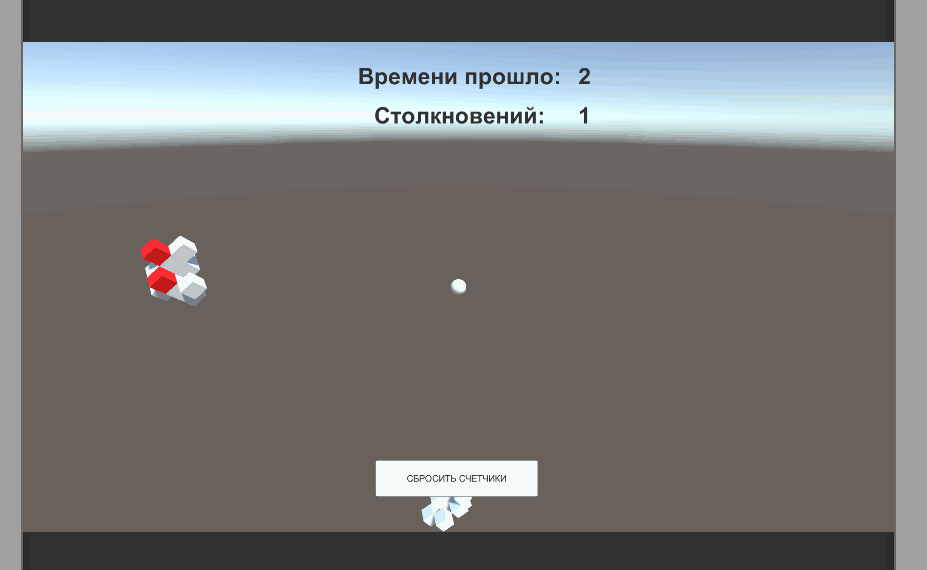

# Targem Test 1
Project for Targem (Unity Jun)

1. Создайте Unity3d-приложение (2020.3 LTS) с единственной сценой. На сцене должны
присутствовать две произвольные конструкции, состоящие из нескольких элементов
(например, кубов). Обе конструкции должны притягиваться к некоторому объекту в сцене
таким образом, чтобы гарантированно сталкиваться друг с другом (но не с объектом). При
столкновении конструкции должны разлетаться на произвольное, но достаточно большое
расстояние. Также при столкновении требуется окрашивать соприкасающиеся элементы
конструкций.

2. Интерфейс пользователя состоит из таймера, счетчика столкновений и кнопки.
а) Таймер должен отсчитывать время от нуля, в секундах.
б) Счетчик столкновений должен учитывать только столкновения конструкций в целом, т.е.
если при столкновении соприкоснулось несколько элементов конструкций, счетчик должен
увеличиться на единицу.
в) Кнопка должна сбрасывать таймер и счетчик в исходное значение.
Сцену, скрипты и прочие ассеты, необходимые для работы приложения, следует
экспортировать в качестве пакета (.unitypackage), который и отправить на проверку.
Поврежденные или нерабочие после импорта пакеты не рассматриваются.

Будет оцениваться:
а) степень выполнения поставленных в задаче требований
б) надежность (по наличию сбоев)
в) производительность (в сравнении с образцом, по среднему времени кадра и динамике
потребления памяти)
г) качество кода (по наличию дублирования логики, избыточности операций и зависимостей и
т.д.)
д) читаемость кода (общая грамотность, соответствие названий переменных и членов
классов их назначению и т.д.)

# Result

